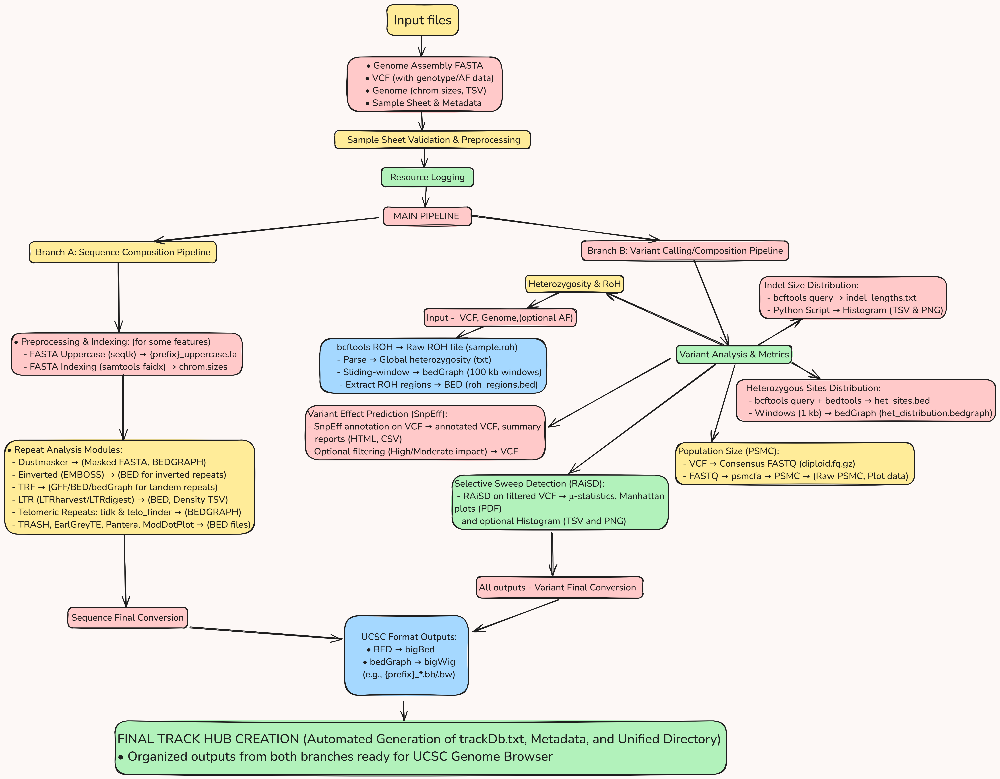

# demo_GAP
Just some examples to have better understanding of the GAP project, under GSOC'25.😊
## Note- This is just for better understanding of the possible approaches, and in no way reflects the actual approaches that will be implemented.

## Low-Complexity Region Detection (dustmasker)  
### Usage  
 **Window Size**: Adjust via `--window_size` (default: 5000 bp).  
   ```bash  
   nextflow run main.nf --input genome.fa --window_size 10000
   ```
## Inverted Repeat Detection (einverted)  
### Usage  
**Window Size**: Adjust via `--window_size` (default: 5000 bp).  
   ```bash  
   nextflow run main.nf --input genome.fa --window_size 10000  
   ```
## TRF Module  
To run:  
```bash  
nextflow run main.nf --fasta <assembly.fasta> [--chunk_size 5000]

```
## Telomeric Analysis  
### Tools  
1. **tidk find**: Identifies clade-specific telomeric repeats.  
2. **telo_finder**: Finds regions matching a user-defined motif (e.g., `TTAGGG`).  

### Parameters  
- `--clade`: Clade for `tidk find` (e.g., "Lepidoptera").  
- `--teloseq`: Telomeric motif for `telo_finder` (default: `TTAGGG`).  

### Outputs  
- `results/tidk_find/`: Clade-specific repeats.  
- `results/telo_finder/`: Motif-specific regions.

# Overall Flowchart - 

 

# References
- Nextflow - https://www.nextflow.io/
- nf core - https://nf-co.re/docs/
- Sanger-tol - https://github.com/sanger-tol
- GAP database - https://gap.cog.sanger.ac.uk/
- Project Board - https://github.com/orgs/sanger-tol/projects/3/views/23
- All pipelines - https://pipelines.tol.sanger.ac.uk/genome_after_party
- Genome Assembly - https://github.com/sanger-tol/genomeassembly
- fasta_windows - https://github.com/tolkit/fasta_windows
- All file formats info - https://genome.ucsc.edu/FAQ/FAQformat.html
- Sanger Guidelines - https://pipelines.tol.sanger.ac.uk/docs/contributing/review_checklist
- Bedtools -  https://bedtools.readthedocs.io/en/latest/  
- bedtobigBed - https://www.encodeproject.org/software/bedToBigBed/
- Some Genome assemblies datasets I found online - NCBI - https://www.ncbi.nlm.nih.gov/datasets/genome/GCF_000001405.40/
- [View Done Datasets](https://github.com/orgs/sanger-tol/projects/3/views/23?filterQuery=status%3ADone&sortedBy%5Bdirection%5D=asc&sortedBy%5BcolumnId%5D=Repository&sortedBy%5Bdirection%5D=asc&sortedBy%5BcolumnId%5D=Status&pane=issue&itemId=67748883&issue=sanger-tol%7Cvariantcalling%7C81)

### Sequence compostion - 
https://github.com/sanger-tol/sequencecomposition

#### Simple repet annotation tools - 
 - refer GDA pipeline - https://github.com/sanger-tol/gda
 - Telomeric annotations - 
    - treeval - https://github.com/sanger-tol/treeval  
    - telomere finder - https://pipelines.tol.sanger.ac.uk/treeval/1.2.2/output#telo-finder
#### Advanced repeat annotation tools -
 - TRASH - https://github.com/vlothec/TRASH
 - Earlgrey - https://github.com/TobyBaril/EarlGrey
    - more info - https://academic.oup.com/mbe/article/41/4/msae068/7635926?login=true
 - Pantera - https://github.com/piosierra/pantera 

- ModDotPlot - https://github.com/marbl/ModDotPlot
  
#### Mappability tracks - 
 - Genmap - https://nf-co.re/modules/genmap_map/
 
### Variant calling/composition- 
Variant Calling - https://github.com/sanger-tol/variantcalling/tree/main
 - deepvariant - https://github.com/google/deepvariant
 - PSMC - https://github.com/lh3/psmc
 - RaisD - https://github.com/alachins/raisd
 - SnpEff - https://github.com/pcingola/SnpEff
   - Info on SnpEff and SnpSift: https://pcingola.github.io/SnpEff/snpeff/introduction/ 
 - Samtools RoH - https://samtools.github.io/bcftools/howtos/roh-calling.html

#### Additional clarifiactions - 
- [Population Genomics](https://github.com/orgs/sanger-tol/projects/3/views/23?filterQuery=status%3ADone&pane=issue&itemId=67748878&issue=sanger-tol%7Cvariantcalling%7C65)
- [Variant calling on long read data](https://github.com/orgs/sanger-tol/projects/3/views/23?filterQuery=status%3ADone&pane=issue&itemId=67748881&issue=sanger-tol%7Cvariantcalling%7C79)

